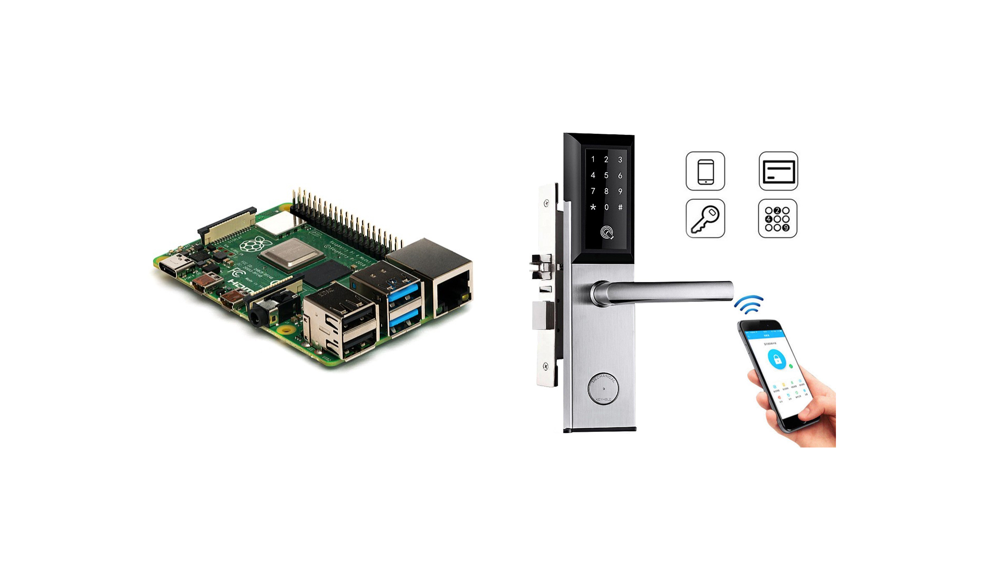

# Welcome a.k.a Abstract
Here's the road less taken: 
A new way of settling payments for private housing properties. 

This is an effort of trying to implement **smart contract** into the existing (traditional) process when dealing with **real-estates transaction**. In this project we will be using the process adopted by the real-estate market in **Hong Kong** as an example. 

{: .center-image }

This project will involve a simple relationship between **tenants and landlords**. Landlords has to keep track on his tenants paying the rents on time, and allow (or deny) the access to his properties on a periodic basis. Our project will aim to **automate the entire process** with the use of smart contract, from keeping track of the rent, to allowing access (or denying access) on a real time query basis. 

Our demo implementation will involve using **[Ethereum](https://ethereum.org) as our blockchain backbone**, and as well as traditional front-end and back-end servers on [Java](https://www.java.com) for our tenants and landlords to interact with the blockchain. 

Our demo implementation will also involve a smart door lock. This door lock will be able to **query the blockchain in realtime**, checking if the tenant has paid his rent, thus allowing or denying access. **A [Raspberry Pi](https://www.raspberrypi.org/) will be used to demonstrate this ability.**

{: .center-image }

# Content
1. [Introduction To Project](#c1)
2. [Existing Process](#c2)
3. [Proposed Improvements](#c3)
4. [Demos](#c4)
5. [Analysis](#c5)

# 1. Introduction To Project

This project is an demo of showing the use of smart contract, which is a **digital form of traditional paper-signed contract**, can help us with doing transaction in a once-off, or a periodic manner, involving one or more parties. 

In the course of the demo, we will demonstrate the ability for blockchain to [decentralize](https://ethereum.org/en/dapps/), and the benefits (and also the drawbacks) of such implementation on **paying rents**. 

The smart contract that we will be using is on the [ethereum blockchain](https://ethereum.org), and the underlying programming language is [solidity](https://solidity.readthedocs.io). At the same time, we will implement a front-end web client written in [Angular with Java](https://angular.io/) for tenant and landlord to manage their properties, a database to store such information [MySQL](https://www.mysql.com/), and a rudimentary door lock using a [Raspberry Pi](https://www.raspberrypi.org/)

# 2. Existing Process

# 3. Proposed Improvements

# 4. Demos

# 5. Analysis

* * *
### Acknolegements
This website serves as the purpose as a part of my presentation on my dissertation for my master degree. All pictures and other, if any, resources used in the making of this page are solely for the purApose of internal use for my dissertation presentation in this website. 

### References
1. [testing link](https://www.google.com)

### Disclaimer 
This is a dissertation submitted by Wong Tin Yan, class of 2017 MSc(CS) HKU.
