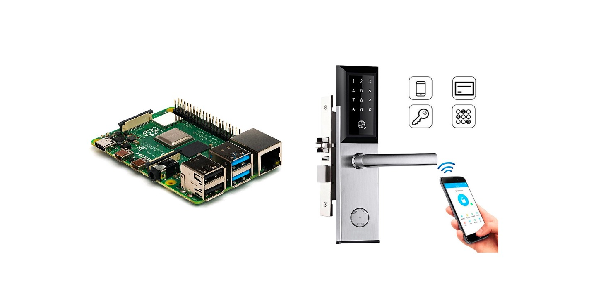
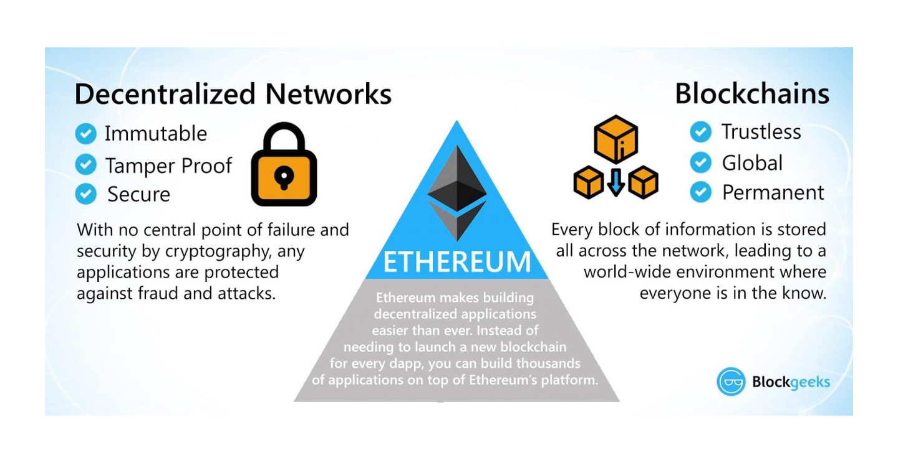

# Here's the road less travelled:
{: .center-image}

# Welcome a.k.a Abstract

This is an effort of trying to implement **smart contract** into the existing (traditional) process when dealing with **real-estates transaction**. In this project we will be using the process adopted by the real-estate market in **Hong Kong** as an example. 

{: .center-image}

This project will involve a simple relationship between **tenants and landlords**. Landlords has to keep track on his tenants paying the rents on time, and allow (or deny) the access to his properties on a periodic basis. Our project will aim to **automate the entire process** with the use of smart contract, from keeping track of the rent, to allowing access (or denying access) on a real time query basis. 

Our demo implementation will involve using **[Ethereum](https://ethereum.org) as our blockchain backbone**, and as well as traditional front-end and back-end servers on [Java](https://www.java.com) for our tenants and landlords to interact with the blockchain. 

Our demo implementation will also involve a smart door lock. This door lock will be able to **query the blockchain in realtime**, checking if the tenant has paid his rent, thus allowing or denying access. **A [Raspberry Pi](https://www.raspberrypi.org/) will be used to demonstrate this ability.**

{: .center-image}

# Content
1. [Introduction To Project](#c1)
2. [Blockchain 101](#c2)
3. [Existing Process](#c2)
4. [Proposed Improvements](#c3)
5. [Demos](#c4)
6. [Analysis](#c5)

# 1. Introduction To Project

This project is an demo of showing the use of smart contract, which is a **digital form of traditional paper-signed contract** implemented on a blockchain, can help us to manage periodic rent payments from tenants to landlords, and in the meantime doing other programmatic logics, including allowing or denying the tenants' access into the premisis with **full automation and total decentralization.** More on decentralization later in [Blockchain 101](#c2). 

The blockchain network we chose for this application is [Ethereum](https://ethereum.org). Blockchain itself provides the ability to **decentralize the control**. And the automation is done by the Ethereum's properties of being **[Turing-Complete](https://ethereum.stackexchange.com/questions/2464/what-does-it-mean-that-ethereum-is-turing-complete)**, i.e. you can write programs (contracts) that can (for the most part) solve any reasonable computational problem.

The smart contract that we will be using is on the [ethereum blockchain](https://ethereum.org), and the underlying programming language is [solidity](https://solidity.readthedocs.io). At the same time, we will implement a front-end web client written in [Angular with Java](https://angular.io/) for tenant and landlord to manage their properties, a database to store such information [MySQL](https://www.mysql.com/), and a rudimentary door lock using a [Raspberry Pi](https://www.raspberrypi.org/)

# 2. Blockchain 101

{: .center-image}

# 3. Existing Process

# 4. Proposed Technical Architecture

# 5. Demos

# 6. Analysis

* * *
### Acknolegements
This website serves as the purpose as a part of my presentation on my dissertation for my master degree. All pictures and other, if any, resources used in the making of this page are solely for the purApose of internal use for my dissertation presentation in this website. 

### References
1. Picture of Hong Kong - https://www.worldfinance.com/wp-content/uploads/2016/07/Hong-Kong.jpg
2. Smart Door Lock - https://boggleup.com/products/wifi-bluetooth-silver-cipher-remote-smart-door-lock-cell-phone-key-password-card
3. Raspberry Pi - https://en.wikipedia.org/wiki/Raspberry_Pi

### Disclaimer 
This is a dissertation submitted by Wong Tin Yan, class of 2017 MSc(CS) HKU.
