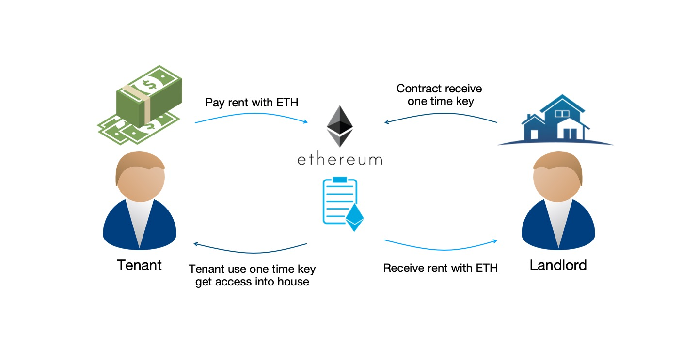
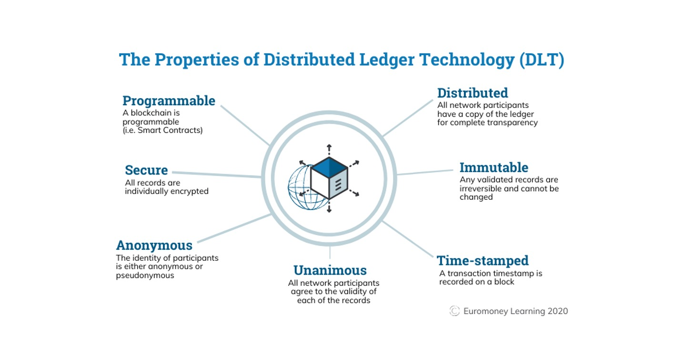
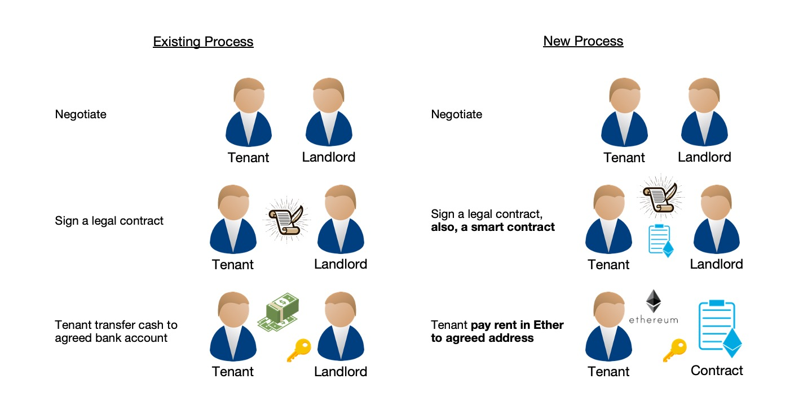
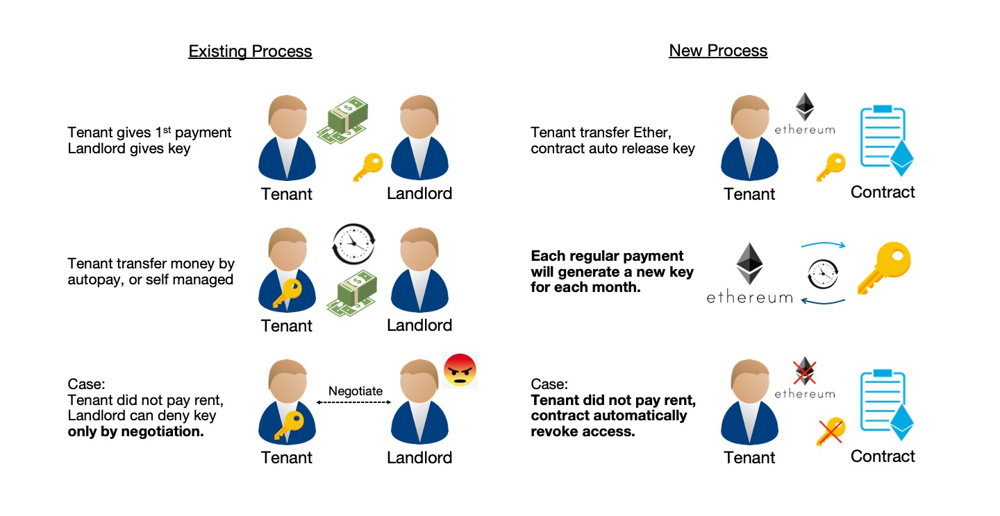
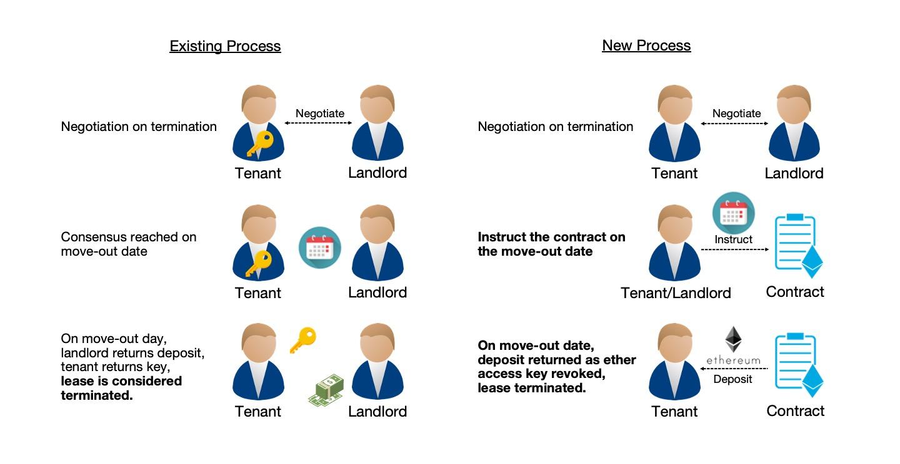
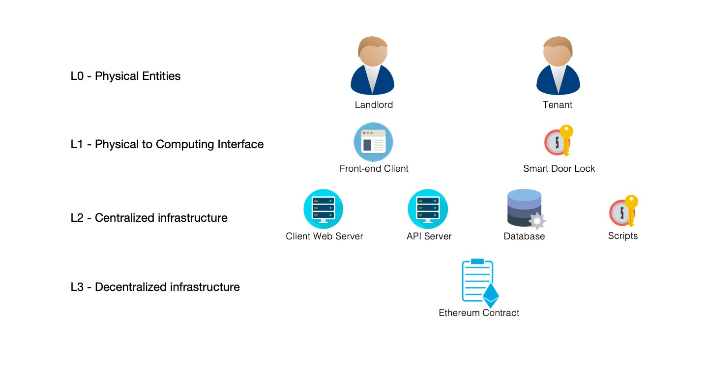
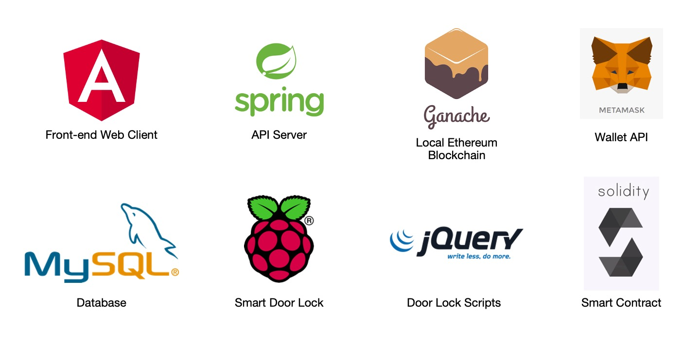

# The Road Not Taken
(Robert Frost, 1915)
>..._Two roads diverged in a wood, and I—_
>
>_I took the one less traveled by,_
>
>_And that has made all the difference._

{: .center-image}

# Welcome a.k.a Abstract

This is an effort of trying to implement **smart contract** into the existing (traditional) process when dealing with **real-estates transaction**. In this project we will be using the process adopted by the real-estate market in **Hong Kong** as an example. 

{: .center-image}

This project will involve a simple relationship between **tenants and landlords**. Landlords has to keep track on his tenants paying the rents on time, and allow (or deny) the access to his properties on a periodic basis. Our project will aim to **automate the entire process** with the use of smart contract, from keeping track of the rent, to allowing access (or denying access) on a real time query basis. 

Our demo implementation will involve using **[Ethereum](https://ethereum.org) as our blockchain backbone**, and as well as traditional front-end and back-end servers on [Java](https://www.java.com) for our tenants and landlords to interact with the blockchain. 

Our demo implementation will also involve a smart door lock. This door lock will be able to **query the blockchain in realtime**, checking if the tenant has paid his rent, thus allowing or denying access. **A [Raspberry Pi](https://www.raspberrypi.org/) will be used to demonstrate this ability.**

{: .center-image}

# Content
1. [Introduction To Project](#c1)
2. [Blockchain 101](#c2)
3. [Existing Process](#c3)
4. [Proposed Improvements](#c4)
5. [Demos](#c5)
6. [Analysis](#c6)

# 1. Introduction To Project

This project is an demo of showing the use of smart contract, which is a **digital form of traditional paper-signed contract** implemented on a blockchain, can help us to manage periodic rent payments from tenants to landlords, and in the meantime doing other programmatic logics, including allowing or denying the tenants' access into the premisis with **full automation and total decentralization.** More on decentralization later in [Blockchain 101](#c2). 

The blockchain network we chose for this application is [Ethereum](https://ethereum.org). Blockchain itself provides the ability to **decentralize the control**. And the automation is done by the Ethereum's properties of being **[Turing-Complete](https://ethereum.stackexchange.com/questions/2464/what-does-it-mean-that-ethereum-is-turing-complete)**, i.e. you can write programs (contracts) that can (for the most part) solve any reasonable computational problem.

{: .center-image}

The smart contract that we will be using is on the [ethereum blockchain](https://ethereum.org), and the underlying programming language is [solidity](https://solidity.readthedocs.io). At the same time, we will implement a front-end web client written in [Angular with Java](https://angular.io/) for tenant and landlord to manage their properties, a database to store such information [MySQL](https://www.mysql.com/), and a rudimentary door lock using a [Raspberry Pi](https://www.raspberrypi.org/)

# 2. Blockchain 101

According to [Wikipedia](https://en.wikipedia.org/wiki/Blockchain), **a blockchain is a growing list of records, called blocks, that are linked using cryptography.** Each block contains a cryptographic hash of the previous block, a timestamp, and transaction data. 

By the use of cryptographic algorithms and agreement protocols, **a blockchain is resistant to modification of its data**. This is because once recorded, the data in any given block cannot be altered retroactively without alteration of all subsequent blocks. Many useful properties of blockchain therefore can be derived.

{: .center-image}

There currently exists many blockchains on decentralized networks. Of the many, **[Ethereum](https://en.wikipedia.org/wiki/Ethereum) is the second-largest cryptocurrency by market capitalization**, after Bitcoin. Also, **ethereum is the most actively used blockchain**. The reason we chose Ethereum instead of Bitcoin is to leverage its smart contract functionality to implement our project. 

A [smart contract](https://en.wikipedia.org/wiki/Smart_contract) is a computer program or a transaction protocol which is intended to **automatically execute, control or document legally relevant events and actions** according to the terms of a contract or an agreement. This will be the key of the project's focus - automatically receive rent (as ETH) and allowing or denying one's access into any agreed upon properties.

{: .center-image}

One of the key properties of our blockchain is the ability to [decentralize](https://www.investopedia.com/terms/b/blockchain.asp#decentralization). That is - the ability not to store data in a single location (centralized), but **store multiple copies of the same data in multiple locations.** Whenever a new block is added to the blockchain, every computer on the network updates its blockchain to reflect the change. By spreading that information across a network, rather than storing it in one central database, blockchain becomes more difficult to tamper with. **We will use this ability to eliminate the disputes against payments histories and records.**

We will also use this as a chance to **implement automation for access control.** All the payment data stored in the Ethereum blockchain are publicly available. A door lock will query the agreed upon contract and retrieve the payment record. Automated access control will thus be implemented through the response from the blockchain.

# 3. Existing process VS Automated process

## Contract creation

A typical contract process creation involves a tenant and a landlord signing a legal document involving some general terms for leasing period, monthly rent, and the landlord's bank account for tenant depositing the rent. 

The automated process will still require some legal documents containing the same information. The difference is to **establish an automated payment address**, i.e. landlord's public key address, for tenant **paying the rent as ETH**. This information will be stored in the blockchain for regular payment use. 

{: .center-image}

## Regular payment

A typical regular payment involves tenant setting up a standing instruction in his bank, instructing the bank to transfer the rent to his landlord's bank account regularly. After the initial payment is confirmed complete (or maybe the deposit is paid as well), the landlord will give the tenant his key (physical access) to the property agreed upon in the contract.

However if there is a dispute in payment (e.g. tenant claiming rent is paid, while landlord is claiming it's not been received), much tedious process or arguments will be needed. Possibly the bank(s) involved will have to step into the discussion to clarify things, involving 4 different parties. Also, if the rent is not fulfilled for a particular period, the physical access is not immediately revoked, but rather need to be claimed by physical action that might involve governmental agencies (e.g. the police). 

The **automated process will handle the receipt of payment**, and transfer of payment in a single contract published in the blockchain. Every step is well recorded and cannot be altered. This will eliminate the possible dispute in payment trasnfer. After the payment is sucessful, it will grant access to the door lock connected to the contract. This will completeley **automate the physical access control**. Also, since the information recorded in the blockchain is public, the physical access control will not be overridden unrightfully by either the tenant or the landlord. 

{: .center-image}

## Contract termination

A typical contract termination involves one party issues a one-month notice to the other party notifying the termination. After the completion of the final payment and return of the deposit, the key (physical access) to the property will be taken back, thus vacating the property.

The **automated process will handle the return of the deposit on the end of lease day** automatically on the descretion of the landlord. After the deposit has been settled, the physical access will be automatically revoked. 

However, since vacating the property involves a lot of human interaction, physical logistics of relocation, and possibly emotional or psychological support, a zero-tolerance in flexibility is highly not flavourable to most tenants or landlords. For this, the automated termination in contract should leave room for flexibility. More on the discussion in [Analysis](#c6).  

{: .center-image}

# 4. Proposed Technical Architecture

There will be two physical entities involved. 
1. Landlord(s) with his property(ies)
2. Tenant(s)

Those two parties will have access to the followings.
1. Landlords will have access to a front-end client (webpage) managing his properties. 
2. Tenants will have access to a front-end client (webpage) managing his rent payments. 
3. Tenants will also have access to a physical door lock. 

{: .center-image}

Behind the scene, the front-end client will have connection to our **API server** which will handle the backend computing. Behind the API server, there is a **MySQL database** storing all the credentials and contracts. Our Ethereum contract will be deployed on our **local blockchain**. The local blockchain is run by [Ganache](https://www.trufflesuite.com/docs/ganache/overview).

{: .center-image}

The tenant will have access to a physical door lock, emulated by a **Raspberry Pi** running on the local network. The Pi will have access to the local blockchain, thus able to query the status of each payment. 

# 5. Demos
This part is intentionally left blank. When the UI and business logics are finalized, demos will be available.

# 6. Analysis
This part is intentionally left blank. When the UI and business logics are finalized, analysis on final product will be available.

* * *
### Acknolegements
This website serves as the purpose as a part of my presentation on my dissertation for my master degree. All pictures and other, if any, resources used in the making of this page are solely for internal use only. 

### References
1. The road not taken - https://mk0thestrivecoxtnap2.kinstacdn.com/wp-content/uploads/2018/08/The-Road-Less-Traveled.png
2. Picture of Hong Kong - https://www.worldfinance.com/wp-content/uploads/2016/07/Hong-Kong.
3. Smart Door Lock - https://boggleup.com/products/wifi-bluetooth-silver-cipher-remote-smart-door-lock-cell-phone-key-password-card
4. Raspberry Pi - https://en.wikipedia.org/wiki/Raspberry_Pi

### Disclaimer 
This is a dissertation submitted by Wong Tin Yan, class of 2017 MSc(CS) HKU.
