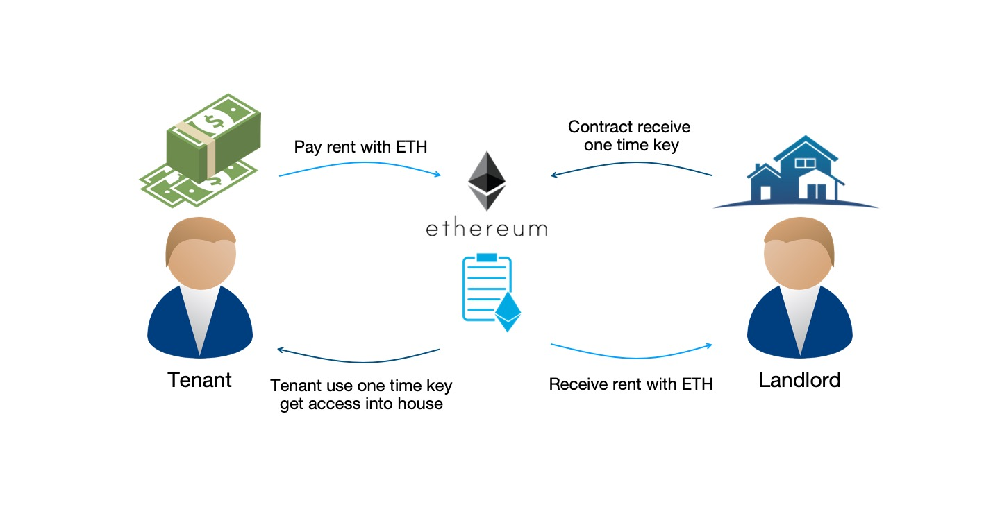
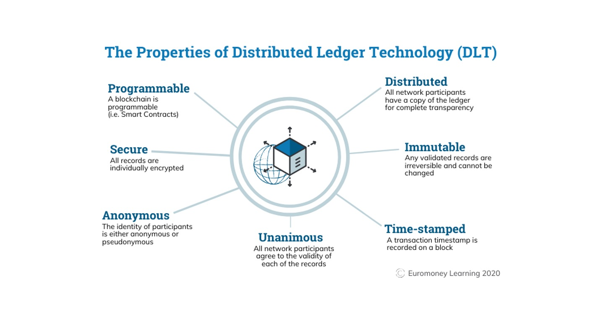

# The Road Not Taken
(Robert Frost, 1915)
>..._Two roads diverged in a wood, and I—_
>
>_I took the one less traveled by,_
>
>_And that has made all the difference._

{: .center-image}

# Welcome a.k.a Abstract

This is an effort of trying to implement **smart contract** into the existing (traditional) process when dealing with **real-estates transaction**. In this project we will be using the process adopted by the real-estate market in **Hong Kong** as an example. 

{: .center-image}

This project will involve a simple relationship between **tenants and landlords**. Landlords has to keep track on his tenants paying the rents on time, and allow (or deny) the access to his properties on a periodic basis. Our project will aim to **automate the entire process** with the use of smart contract, from keeping track of the rent, to allowing access (or denying access) on a real time query basis. 

Our demo implementation will involve using **[Ethereum](https://ethereum.org) as our blockchain backbone**, and as well as traditional front-end and back-end servers on [Java](https://www.java.com) for our tenants and landlords to interact with the blockchain. 

Our demo implementation will also involve a smart door lock. This door lock will be able to **query the blockchain in realtime**, checking if the tenant has paid his rent, thus allowing or denying access. **A [Raspberry Pi](https://www.raspberrypi.org/) will be used to demonstrate this ability.**

{: .center-image}

# Content
1. [Introduction To Project](#c1)
2. [Blockchain 101](#c2)
3. [Existing Process](#c2)
4. [Proposed Improvements](#c3)
5. [Demos](#c4)
6. [Analysis](#c5)

# 1. Introduction To Project

This project is an demo of showing the use of smart contract, which is a **digital form of traditional paper-signed contract** implemented on a blockchain, can help us to manage periodic rent payments from tenants to landlords, and in the meantime doing other programmatic logics, including allowing or denying the tenants' access into the premisis with **full automation and total decentralization.** More on decentralization later in [Blockchain 101](#c2). 

The blockchain network we chose for this application is [Ethereum](https://ethereum.org). Blockchain itself provides the ability to **decentralize the control**. And the automation is done by the Ethereum's properties of being **[Turing-Complete](https://ethereum.stackexchange.com/questions/2464/what-does-it-mean-that-ethereum-is-turing-complete)**, i.e. you can write programs (contracts) that can (for the most part) solve any reasonable computational problem.

{: .center-image}

The smart contract that we will be using is on the [ethereum blockchain](https://ethereum.org), and the underlying programming language is [solidity](https://solidity.readthedocs.io). At the same time, we will implement a front-end web client written in [Angular with Java](https://angular.io/) for tenant and landlord to manage their properties, a database to store such information [MySQL](https://www.mysql.com/), and a rudimentary door lock using a [Raspberry Pi](https://www.raspberrypi.org/)

# 2. Blockchain 101

According to [Wikipedia](https://en.wikipedia.org/wiki/Blockchain), **a blockchain is a growing list of records, called blocks, that are linked using cryptography.** Each block contains a cryptographic hash of the previous block, a timestamp, and transaction data. 

By the use of cryptographic algorithms and agreement protocols, **a blockchain is resistant to modification of its data**. This is because once recorded, the data in any given block cannot be altered retroactively without alteration of all subsequent blocks. Many useful properties of blockchain therefore can be derived.

{: .center-image}

There currently exists many blockchains on decentralized networks. Of the many, **[Ethereum](https://en.wikipedia.org/wiki/Ethereum) is the second-largest cryptocurrency by market capitalization**, after Bitcoin. Also, **ethereum is the most actively used blockchain**. The reason we chose Ethereum instead of Bitcoin is to leverage its smart contract functionality to implement our project. 

A [smart contract](https://en.wikipedia.org/wiki/Smart_contract) is a computer program or a transaction protocol which is intended to **automatically execute, control or document legally relevant events and actions** according to the terms of a contract or an agreement. This will be the key of the project's focus - automatically receive rent (as ETH) and allowing or denying one's access into any agreed upon properties.

{: .center-image}

One of the key properties of our blockchain is the ability to decentralize. That is - the ability not to store data in a single location (centralized), but **store multiple copies of the same data in multiple locations.** Whenever a new block is added to the blockchain, every computer on the network updates its blockchain to reflect the change. By spreading that information across a network, rather than storing it in one central database, blockchain becomes more difficult to tamper with. **We will use this ability to eliminate the disputes against payments histories and records.**

We will also use this as a chance to **implement automation for access control.** All the payment data stored in the Ethereum blockchain are publicly available. A door lock will query the agreed upon contract and retrieve the payment record. Automated access control will thus be implemented through the response from the blockchain.

# 3. Existing process VS Automated process

# 4. Proposed Technical Architecture

# 5. Demos

# 6. Analysis

* * *
### Acknolegements
This website serves as the purpose as a part of my presentation on my dissertation for my master degree. All pictures and other, if any, resources used in the making of this page are solely for internal use only. 

### References
1. The road not taken - https://mk0thestrivecoxtnap2.kinstacdn.com/wp-content/uploads/2018/08/The-Road-Less-Traveled.png
2. Picture of Hong Kong - https://www.worldfinance.com/wp-content/uploads/2016/07/Hong-Kong.jpg
3. Smart Door Lock - https://boggleup.com/products/wifi-bluetooth-silver-cipher-remote-smart-door-lock-cell-phone-key-password-card
4. Raspberry Pi - https://en.wikipedia.org/wiki/Raspberry_Pi

### Disclaimer 
This is a dissertation submitted by Wong Tin Yan, class of 2017 MSc(CS) HKU.
